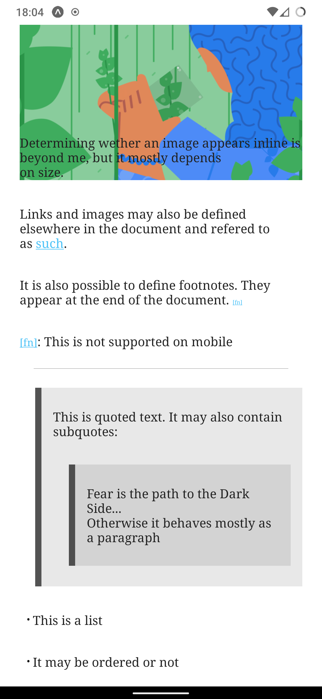
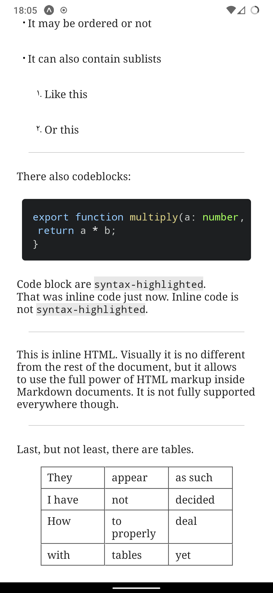

# @oz/react-native-markdown

Render markdown formatted strings to native
components. Uses [`@expo/html-elements`](https://www.npmjs.com/package/@expo/html-elements) to
render semantic elements on the web. Developed and tested with **Expo Go**

[`remark`](https://www.npmjs.com/package/remark)
/[`unified`](https://www.npmjs.com/package/unified) is used for parsing. Includes [`remark-gfm` plugin](https://www.npmjs.com/package/remark-gfm)
by default, but you can customize parser
plugins.

Uses [`react-native-render-html`](https://www.npmjs.com/package/react-native-render-html)
to display inline HTML as native elements.

Uses [`react-native-syntax-highlighter`](https://www.npmjs.com/package/react-native-syntax-highlighter)
to syntax-highlight code blocks.

## Screenshots

<p align="center">


</p>

## API

### Example

```tsx
import { atomDark } from "react-syntax-highlighter/styles/prism";
import { Markdown } from "@oz/react-native-markdown";

export default function App() {
	return (
		<SafeAreaView style={{ flex: 1 }}>
			<ScrollView>
				<Markdown
					source={{ markdown: "# Heading" }}
					codeStyle={{ theme: atomDark }}
				/>
			</ScrollView>
		</SafeAreaView>
	);
}
```

### Props

> Note
> Style props **DO NOT** accept StyleSheet's

Prop | Type | Required | Default | Value
-----|------|----------|---------|-------
source | object | yes | { markdown: undefined, ast: undefined } | Markdown string to render as `{ markdown }` or `remark` produced ast as `{ ast }`
style | ViewStyle | no | `{ flex: 1, alignSelf: "center", width: 800, padding: 25 }` | The style for the container element (`<Article />`)
pStyle | TextStyle | no | `{ color: "#212121", fontFamily: fontMap?.normal || "serif", fontSize: 16 }` | Paragraph style
hStyle | TextStyle | no | `{ fontFamily: fontMap?.bold || "sans-serif" }` | Heading style
hSizeStep | number | no | 2 | How much to increase heading font size per level
aStyle | TextStyle | no | `{ color: "#4fc3f7", textDecorationLine: "underline" }` | Anchor (link) style
codeStyle | object | no | `{ fontFamily: fontMap?.monospace || "monospace", fontSize: (pStyle.fontSize || 16) * 0.95 }` | Valid props are: `{ fontFamily?: string, fontSize?: number, theme?: react-syntax-highlighter prism theme }`
tableStyle | object | no | `{ color: color(pStyle.color as string, 0.75), width: "80%", borderWidth: 1, paddingVertical: 5, paddingHorizontal: 10 }` | Valid props are `{ color: string, width: string | number, borderWidth: number, paddingVertical: number, paddingHorizontal: number }` Note that `color` here refers to border color. Padding is applied to each cell.
fontMap | object | no | `{ normal: undefined, bold: undefined, italic: undefined, monospace: undefined }` | A mapping of font families to use across the document
htmlFallbackFonts | object | no | undefined | A mapping of font families to use in HTML when font is not specified, check `react-native-render-html` docs for more information, as this prop is passed through as is.
